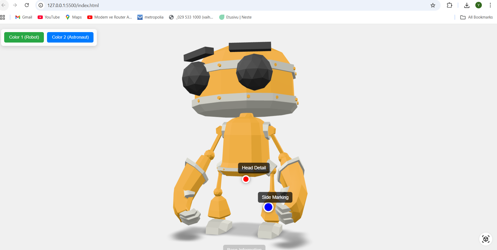

# 🌐 Vk6 - 3D Model Viewer with AR Capabilities

This project demonstrates the integration of Google's `<model-viewer>` web component to create an interactive 3D model on a web page. Users can rotate, zoom, switch between different model variants, and view the model in Augmented Reality (AR) mode on compatible devices.

## ✨ Features

-   **Interactive 3D Viewing:** Users can freely inspect the 3D model using mouse or touch controls.
-   **Variant Switching:** Easily switch between different visual variants (e.g., material or color) of the model.
-   **Hotspot Information:** Interactive information points (hotspots) placed at specific coordinates on the model.
-   **Augmented Reality (AR):** Capability to view the model in the real world using AR on supported mobile devices.

---

## 🚀 Live Demo

You can view the running application using the following link (The link you will submit for the assignment):

[https://modelviewer02.vercel.app/](https://modelviewer02.vercel.app/)

---

## 📸 Screenshots

To illustrate the functionality, replace the image links below with the actual URLs of your screenshots.

### Main View (Model and Controls)

A screenshot showing the main view of the model and the variant/hotspot controls.



---

## 🛠️ Setup and Running Locally

To run this project on your local machine:

1.  **Project Structure:** Ensure your project has the correct file structure, especially with the model file:
    ```
    modelviewer-project/
    ├── index.html
    └── model/
        └── RobotExpressive.glb
    ```

2.  **Open with Live Server:**
    Open the `index.html` file using a local HTTP server (like VS Code's **Live Server** extension) to avoid browser security restrictions related to loading local files.

## ⚙️ Technologies Used

-   **HTML5 & CSS3**
-   **JavaScript** (for handling variant switching logic)
-   **<model-viewer>:** The web component used for 3D and AR rendering.
-   **GLB (glTF):** The required 3D model format.

---

## 👨‍💻 

-   **[Yasin]**